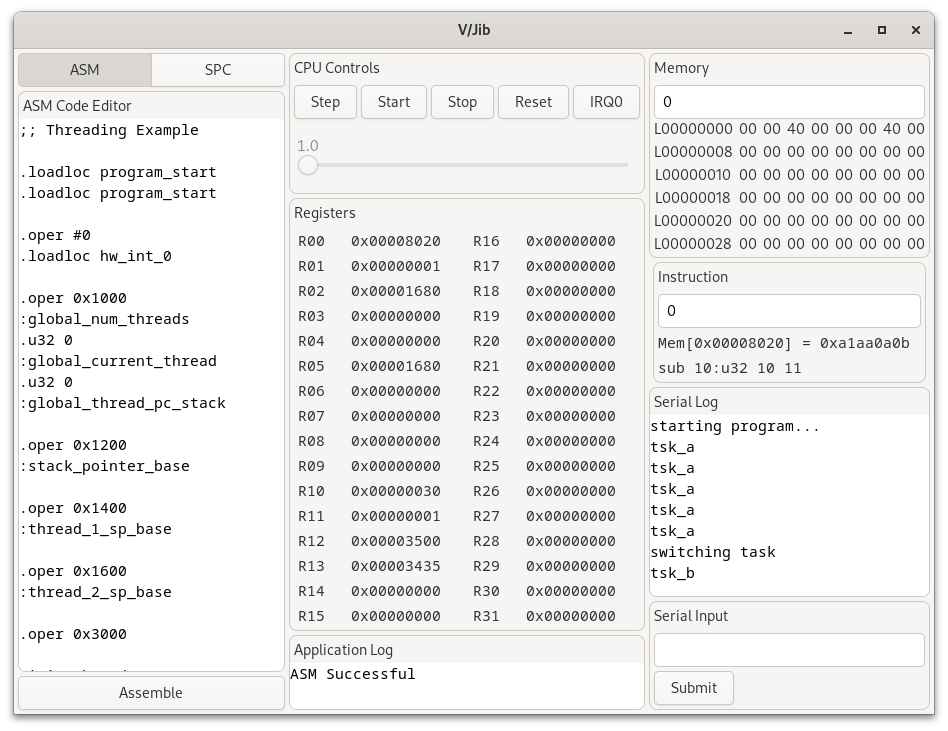

# Solarium

Solarium provides interfaces to provide a processor (jib), assembler (jasm), and basic high-level language (c/buoy) around a hypothetical 32-bit processor that provides a simple ISA. See the isa.tex document in the doc/ folder for more information.

## Libraries

Several libraries are provided:
* jib implements the processor and ISA itself in a simple virtual machine
* jasm implements a basic assembler.
* cbuoy implements the high-level language

## Programs

Programs included are listed below:
* virtual-jib provides a visual test-bench to compile and run programs

