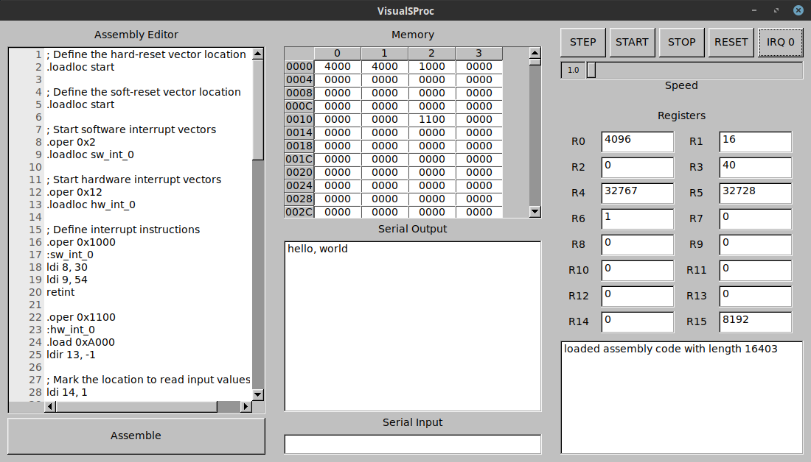

# SolariumProcessor

SolariumProcessor, or SProc, is a simple 16-bit hypothetical processor that implements a basic Instruction Set Architecture (ISA). See the isa.tex document in the doc/ folder for more information.

## Libraries

Two basic libraries are provided:
* libsproc implements the processor and ISA itself in a simple virtual machine
* libsproc-assemble implements a basic assembler.

## Programs

Programs included are listed below:
* virtual-sproc provides a visual test-bench to compile and run SolariumCPU programs

