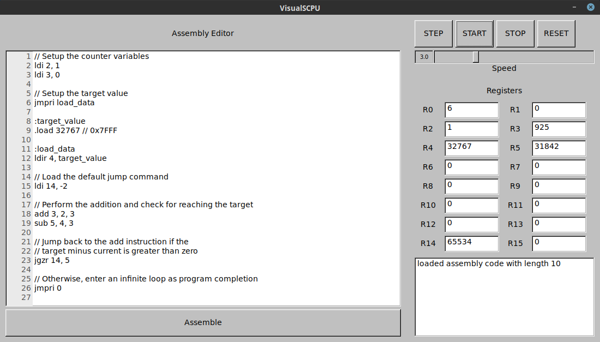

# SolariumCPU

SolariumCPU, or scpu, is a simple 16-bit hypothetical processor that implements a basic Instruction Set Architecture (ISA). See the isa.tex document in the doc/ folder for more information.

## Libraries

Two basic libraries are provided:
* libscpu implements the processor and ISA itself in a simple virtual machine
* libscpu-assemble implements a basic assembler.

## Programs

Programs included are listed below:
* scpu-assemble provides an executable version of the assembler that can read an input file and provide a binary output file
* virtual-scpu provides a visual test-bench to compile and run SolariumCPU programs

